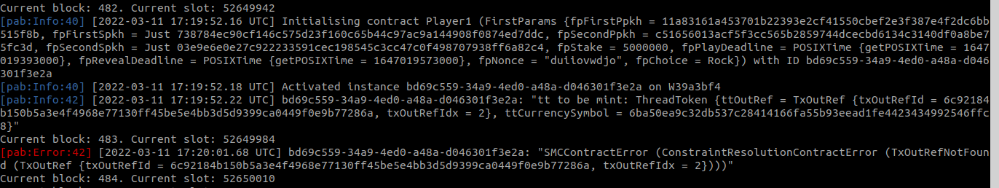

# Rock, Paper, Scissors on PAB (Cardano Testnet)


## Assuming 

</br>

- T1 - **cardano-node** running and in sync. 
- T2 - **chain-index** running and in sync.  
- T3 - **cardano-wallet** (1) running on port 8090  (default) 
- T4 - **cardano-wallet** (2) running on port 8092  (add --port 8092 to cardano-wallet serve) 

</br>

## Running the game 

</br>

You'll need 9 terminals (T0 .. T8)

- T0 - run scripts + run the game
- T1 - cardano-node
- T2 - chain-index
- T3 - cardano-wallet-1
- T4 - cardano-wallet-2
- T5 - pab-1
- T6 - pab-2
- T7 - monitor-1
- T8 - monitor-2

</br>

1. T0 - `./create-wallet.sh w1 <passphrase_1> testnet/restore-wallet-1.json`

2. T0 - `./load-wallet.sh testnet/restore-wallet-1.json 8090`

3. T0 - Take id  `... "id":"<wid1>" ...`  from previous **load-wallet** terminal result.
  
4. T0 - `./get-address.sh <wid1> 8090`
  
5. T0 - Pick one from previous **get-address** terminal result: `<address_1>`

6. Modify **ADDRESS1** value in **env.sh**:  `export ADDRESS1=<address_1>` 

7. Modify **WALLETID1** value in **env.sh**: `export export WALLETID1=<wid1>`

8. T0 - Source **env.sh**: `. env.sh` 

9. Fund **address_1** (faucet for example)

10. T3 - Wait for **cardano-wallet-1** getting synced ("In sync!")

</br>

11. T0 - `./create-wallet.sh w2 <passphrase_2> testnet/restore-wallet-2.json`

12. T0 - `./load-wallet.sh testnet/restore-wallet-2.json 8092`

13. T0 - Take id  `... "id":"<wid2>" ...`  from previous **load-wallet** terminal result.
  
14. T0 - `./get-address.sh <wid2> 8092`
  
15. T0 - Pick one from previous **get-address** terminal result: `<address_2>`

16. Modify **ADDRESS2** value in **env.sh**:  `export ADDRESS1=<address_2>` 

17. Modify **WALLETID2** value in **env.sh**: `export export WALLETID2=<wid2>`

18. T0 - Source **env.sh**: `. env.sh` 

19. Fund **address_2** (Yoroi Nightly or using ./send_from_1_to_2.sh )

10. T4 - Wait for **cardano-wallet-2** getting synced ("In sync!")

</br>

21. T5 - `./migrate-pab.sh testnet/pab-config-1.yml`

22. T5 - `./start-testnet-pab.sh testnet/pab-config-1.yml <passphrase_1>`

</br>

21. T6 - `./migrate-pab.sh testnet/pab-config-2.yml`

22. T6 - `./start-testnet-pab.sh testnet/pab-config-2.yml <passphrase_2>`

</br>

23. T7 - Source **env.sh**: `. env.sh` 

24. T7 - Monitor **ADDRESS1**: `./monitor-1.sh`

</br>

23. T8 - Source **env.sh**: `. env.sh` 

24. T8 - Monitor **ADDRESS1**: `./monitor-2.sh`

</br>

25. T0 - Play the game:  `./game.sh <playDeadlinePOSIXTIME> <revealDeadlinePOSIXTIME> <Choice1> <Choice2> <stake_in_lovelaces> <skipPlayer2> ` Example: `./game.sh 1647002125000 1647002365000 Paper Paper 5000000 False`

</br>

## Lessons learned

</br>

- In order to mint the **threadToken** at "initializing time" on PAB/Testnet, the stateMachine needs some help from us. The thing is that if we run `runInitialise client (GameDatum bs Nothing) v`, **firstGame Contract** fails with **TxOutRefNotFound** error. I checked that the **utxo** obtained from `getThreadToken` really exists and keeps unspent. However, for some reason, at the time of minting fails because PAB can't find it. **Solution**: Use `runInitialiseWith` and add a lookup with the utxo ref. (Please, check codebase). Notice that this lookup is NOT needed when the contract runs on **EmulatorTrace**. 

</br>



</br>

- In order to run the contract on **PAB/Testnet** we need to modify `scSlotZeroTime` in **pab-config-1.yml** and **pab-config-2.yml**. The `scSlotZeroTime` value in **file pab-config.yml** (week06) seems not to work when when deadlines comes into play. I found unexpected results, concretely time doesn't match with Testnet time. **Solution**: Replace `scSlotZeroTime` as follows:

</br>

```
pscSlotConfig:
    # scSlotZeroTime: 1596059091000 # Wednesday, July 29, 2020 21:44:51 - shelley launch time in milliseconds
    scSlotZeroTime:   1594369216000 #  (timeWhenSlotChangedTo1Sec (1595967616) - slotWhenSlotChangedTo1Sec (1598400)) * 1000
    # Check https://cardano.stackexchange.com/questions/7034/how-to-convert-posixtime-to-slot-number-on-cardano-testnet/7035#7035
```    